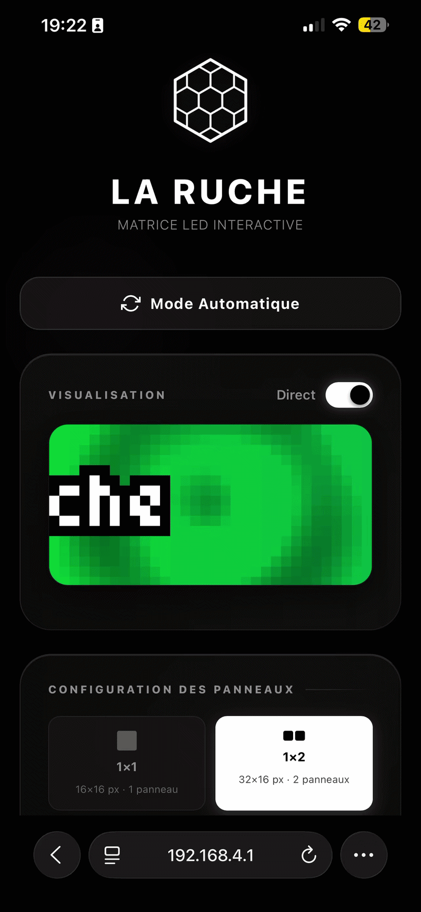
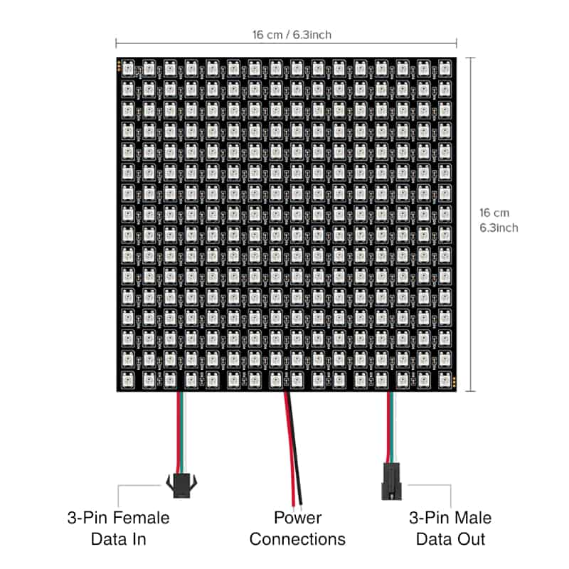
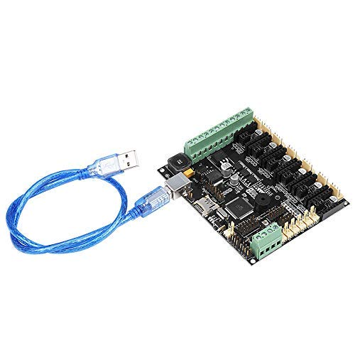
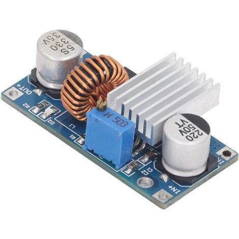
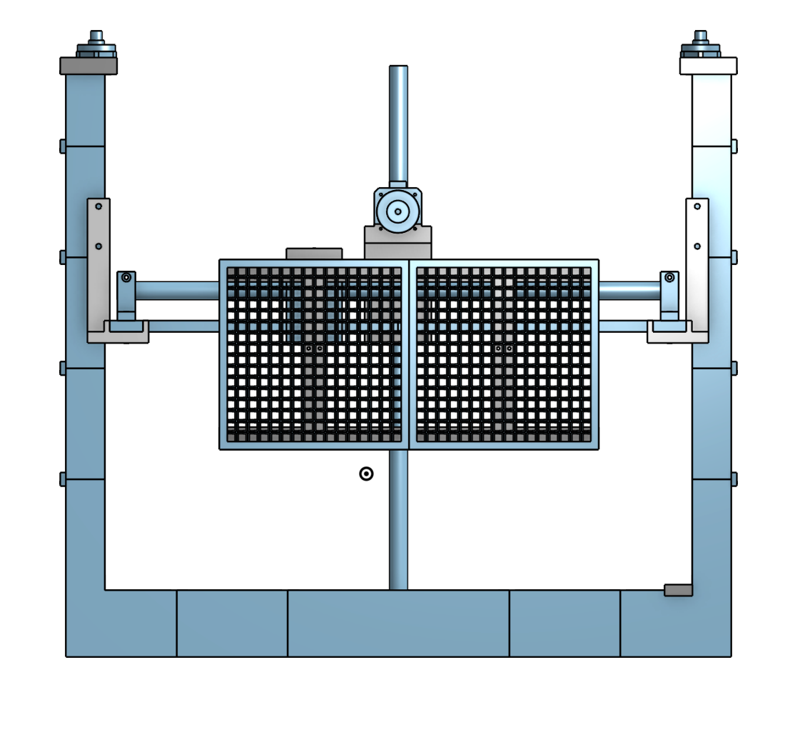
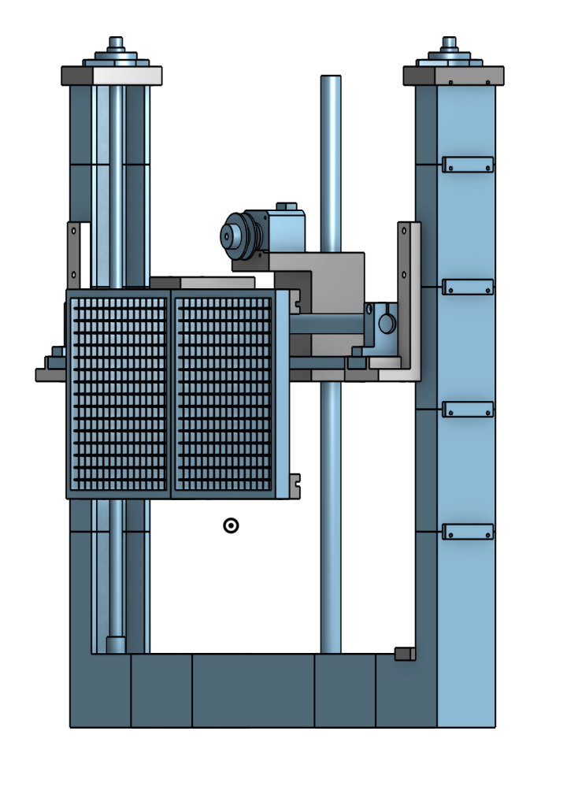
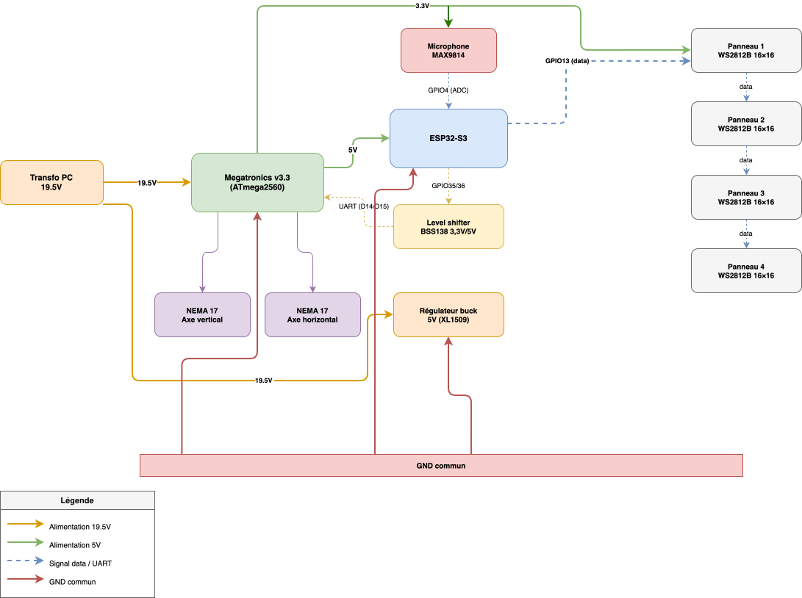
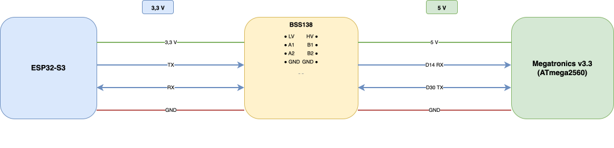
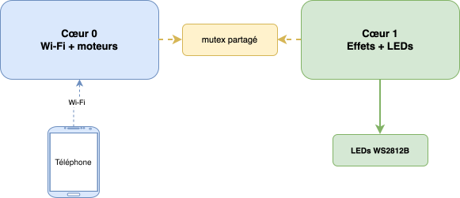
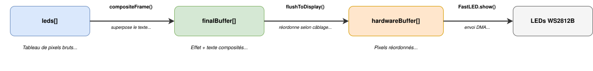

# La Ruche Matrix

**Wi-Fi controlled LED matrix panel for live events: ESP32-S3 + 1 024 WS2812B LEDs on a motorized 2-axis structure.**

Built by Matthieu POUPIN & Marceau GUIGUI - Option Culture Maker, Eirlab / ENSEIRB-MATMECA, 2026.

<p align="center">
  
</p>

---

## Overview

La Ruche Matrix is an interactive LED panel designed for music events. The audience connects from their phone and can display scrolling text, draw pixel by pixel, or pick from 31 animations: all in real time, without any app.

- **1 024 RGB LEDs:** 4 × WS2812B 16×16 panels chained together
- **Wi-Fi control:** connect to the panel like a hotspot, open a browser, done
- **31 animations:** Matrix rain, Pac-Man, Game of Life, Pong, 3D cube, audio visualizer...
- **2-axis motorized structure:** repositions the panel without dismounting anything
- **Budget: ~150–160 €**

---

## Demo

<p align="center">
  
</p>

---

## Hardware

### Electronics

| Component | Qty | Notes |
|-----------|-----|-------|
| ESP32-S3-N16R8 | 1 | Main controller — Wi-Fi, native USB, 16 MB flash |
| WS2812B 16×16 LED panels | 4 | Individually addressable, chained in series |
| Megatronics v3.3 | 1 | Salvaged — runs Marlin, controls motors via ATmega2560 |
| 19.5 V PSU (modified PC adapter) | 1 | Salvaged |
| XL1509 buck converter | 1 | 19.5 V → 5 V, powers ESP32 |
| BSS138 4-channel level shifter | 1 | 3.3 V ↔ 5 V between ESP32 and Megatronics |
| MAX9814 microphone | 1 | Audio-reactive animations |
| Wires, connectors, perfboard | — | |

<p align="center">
  
  <br><em>WS2812B 16×16 panel: Data In, Power, Data Out</em>
</p>

<p align="center">
  
  <br><em>Megatronics v3.3: runs Marlin, controls the stepper motors</em>
</p>

<p align="center">
  
  <br><em>XL1509 adjustable buck converter: 19.5 V → 5 V</em>
</p>

### Mechanical

The structure is inspired by a Cartesian 3D printer: two independent axes let you reposition the panel in space without unmounting it from the light bridge.

| Component | Qty | Unit price |
|-----------|-----|-----------|
| SH16/SK16 shaft supports | 4 | 6.11 € |
| SH8/SK8 shaft supports | 4 | 4.26 € |
| SC16UU linear bearings (∅16 mm) | 4 | 15.27 € |
| SC8UU linear bearings (∅8 mm) | 2 | 4.95 € |
| ∅16 mm h6 precision shaft — 500 mm | 2 | 9.64 € |
| ∅8 mm h6 precision shaft — 500 mm | 2 | 5.91 € |
| TR10×4P2 trapezoidal leadscrew — 500 mm | 2 | 5.85 € |
| TR10×4P2 bronze/alu leadscrew nut | 2 | 31.63 € |
| D20L25 flexible coupling (5/10 mm) | 2 | 6.60 € |
| GT2 open belt 6 mm (~1 000 mm) | 4 | 7.15 € |
| GT2 20-tooth pulley (5 mm bore) | 2 | 2.27 € |
| NEMA 17 stepper motors (42SH0034D) | 2 | Salvaged (~10 € each otherwise) |
| PLA printed parts | — | STL files in this repo |
| Aluminium profiles + hardware | — | Frame reinforcement |

**Y axis (vertical):** a NEMA 17 drives a TR10×4P2 trapezoidal leadscrew. A second screw synchronized by belt ensures parallel motion. The bronze nut integral to the carriage moves up or down as the screw turns — slow, precise, and self-locking (no power needed to hold position).

**X axis (horizontal):** the second motor drives a carriage along 16 mm precision shafts via GT2 belt.

<p align="center">
  
  <br><em>Front view: 3D CAD of the mechanical structure</em>
</p>

<p align="center">
  
  <br><em>Side view</em>
</p>

### Tools required

- 3D printer (PLA)
- Soldering iron
- Multimeter
- VSCode + PlatformIO extension

---

## Wiring

19.5 V feeds the XL1509 buck converter, which steps down to 5 V. This 5 V goes into the ESP32-S3's `5V IN` pin; the ESP regulates internally to 3.3 V. The four WS2812B panels are powered from this 3.3 V rail. They tolerate it in practice, and FastLED caps total current at 500 mA. The motors are powered directly at 19.5 V through the Megatronics.

The four panels are chained in series: a single data wire from **GPIO 5** runs through each panel in order. **A common ground between the ESP, panels, and Megatronics is mandatory**. Without it, the data signal is interpreted randomly.

<p align="center">
  
  <br><em>Simplified wiring diagram</em>
</p>

The ESP32-S3 runs at 3.3 V and the ATmega2560 at 5 V. A BSS138 4-channel level shifter is required between the two.

<p align="center">
  
</p>

---

## Firmware

### Quickstart (5 minutes)

1. Install [VSCode](https://code.visualstudio.com/) + the **PlatformIO** extension
2. Clone the repo: `git clone https://github.com/matthieupoupin3704-alt/la-ruche-matrix`
3. Open the folder in VSCode
4. Plug in the ESP32-S3 via USB-C (N16R8 recommended for RAM)
5. In PlatformIO: click **Upload** (`esp32dev` environment)

PlatformIO downloads dependencies, compiles, and flashes automatically.

### Code structure

| File | Role |
|------|------|
| `src/main.cpp` | Web server, scrolling text, settings persistence, dual-core task management |
| `include/effects.h` | 31 animations — each effect is an independent function |

### Dual-core architecture

The ESP32 has two cores: Wi-Fi handles HTTP requests on core 0, while LEDs compute and render on core 1. A mutex protects shared buffers — without it, random visual corruption occurs.

<p align="center">
  
  <br><em>Dual-core task architecture</em>
</p>

### Image pipeline

<p align="center">
  
  <br><em>Effect → Topology mapping → Physical output</em>
</p>

### Topologies

Switchable at runtime from the web interface — no recompilation needed. Resolution (`matW`, `matH`) and active LED count are global variables recalculated on the fly. Choice is persisted in ESP flash.

| Topology | Resolution | Panels |
|----------|-----------|--------|
| 1×1 | 16×16 px | 1 |
| 1×2 | 32×16 px | 2 side by side |
| 1×4 | 64×16 px | 4 in a strip |
| 2×2 | 32×32 px | 4 in a square |

### Motor control

The Megatronics v3.3 runs Marlin on its ATmega2560. The ESP32 sends G-code over UART (Serial3, 115200 baud). Marlin handles acceleration and motion profiles natively.

```cpp
// Relative mode — no need to track absolute position
snprintf(buf, sizeof(buf), "G91\nG1 Z%.1f X%.1f F%d\nG90", dz, dx, feedrate);
Serial1.println(buf);
```

Emergency stop sends `M410` immediately.

In `marlin_config/Configuration.h`:

```cpp
#define SERIAL_PORT 0      // ATmega native USB
#define SERIAL_PORT_2 3    // Serial3 → ESP32
#define BAUDRATE_2 115200
```

> **Note:** The vertical motor is wired to the Z slot on the Megatronics, not Y — the Y driver was faulty on this salvaged board.

---

## Usage

### Connecting

1. Power on the panel
2. On your phone: Wi-Fi → connect to **La-Ruche-Matrix**
3. Open a browser and go to `192.168.4.1`

The interface works on any mobile browser.

### What you can do

- **Scrolling text:** type a message, pick one of 7 fonts (from tiny pixel art to large sans-serif), send. Text color adapts to the chosen hue.
- **Freehand drawing:** touchscreen canvas for pixel-by-pixel drawing, with pencil, eraser, and a La Ruche logo button.
- **31 animations:** Matrix rain, Doom corridor, Pac-Man, Game of Life, Pong, rotating 3D cube, audio visualizer, and more. Each reacts to hue, speed, and brightness. Some react to sound via the MAX9814 microphone.
- **Panel movement:** touchscreen D-pad sends movement commands, with an emergency stop button.
- **Auto mode:** the panel cycles through animations and fonts every 15 seconds automatically.
- **Live preview:** toggle a real-time view of what's displayed on the panel in your browser, useful for technicians standing behind it.

---

## Adding your own animations

In `include/effects.h`, all animations follow the same pattern:

```cpp
void myEffect() {
    for (uint8_t y = 0; y < MATRIX_H; y++)
        for (uint8_t x = 0; x < MATRIX_W; x++)
            _px(x, y) = CHSV(COULEUR_HUE + x * 4, 255, 200);
}
```

- `_px(x, y)` writes a pixel in logical coordinates
- `COULEUR_HUE` is the hue chosen by the user
- `MATRIX_W` / `MATRIX_H` adapt automatically to the active topology

Then add the function to `_table[]`, its name to `_names[]`, and increment `COUNT`: the interface picks it up automatically.

---

## Known limitations

- **Y axis:** mechanical roughness on one of the vertical shafts now blocks movement
- **X axis:** GT2 belt was particularly difficult to set up — a leadscrew would have been a better choice here

---

## Acknowledgements

Thanks to [Eirlab](https://www.eirlab.net/) for providing the workspace, equipment loans, and material purchases that made this project possible.

Special thanks to **Julien Allali**, **Antonio Berejano**, and **Adrien Boussicault** for their guidance and support throughout the project.

---

## License

Open source. Code and CAD files available in this repository.

---

*Matthieu POUPIN & Marceau GUIGUI - ENSEIRB-MATMECA, Eirlab, 2026*  
*Full build log: [eirlab.net](https://www.eirlab.net/2026/04/20/lumiere-scenique/)*
